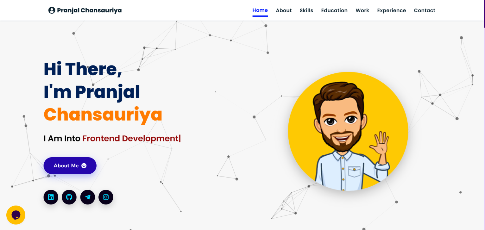

# 🌐 Portfolio Website

A modern, responsive personal portfolio website built using **HTML5, CSS3, JavaScript**, and various frontend libraries to showcase my skills, projects, education, experience, and achievements.

## 🚀 Live Demo

🔗 **Visit Now:** [https://pranjalchansauriya-protfolio.vercel.app/](https://pranjalchansauriya-protfolio.vercel.app/)

---

## 📌 Tech Stack

* HTML5
* CSS3
* JavaScript (ES6)

### ✨ Libraries & Tools

* Font Awesome
* Particles.js
* Typed.js
* Vanilla Tilt.js
* ScrollReveal.js
* JSON

---

## 📌 Features

* 💻 Responsive Design
* 👨‍💻 About Me Section
* 🛠️ Skills Showcase
* 📂 Projects Gallery
* 🎓 Education Timeline
* 💼 Experience Section
* 📄 Resume Download
* 📞 Contact Information
* ✨ Smooth Animations & Interactive UI

---

## 📌 Sneak Peek

### 🖥️ Home Page

<p align="center">
  
</p>

> **Replace the image above with a screenshot of your portfolio.**

---

## 📂 Folder Structure

```text
Portfolio-Website/
│
├── assets/
│   ├── css/
│   ├── js/
│   ├── images/
│
├── experience/
├── projects/
├── skills.json
├── index.html
├── 404.html
└── README.md
```

---

## 🚀 Getting Started

Clone the repository

```bash
git clone https://github.com/Pranjalchansa/Portfolio-Website.git
```

Move into the project directory

```bash
cd Portfolio-Website
```

Run the project

Simply open **index.html** in your preferred browser.

---

## 📬 Contact

Feel free to connect with me through the following platforms:

* 💼 **LinkedIn:** [https://www.linkedin.com/in/pranjal-chansauriya-77590132a/](https://www.linkedin.com/in/pranjal-chansauriya-77590132a/)
* 🐙 **GitHub:** https://github.com/Pranjalchansa
* 📧 **Email:** [pranjalchansauriya@gmail.com](mailto:pranjalchansauriya@gmail.com)

---

## ⭐ If you like this project

Please consider giving this repository a **⭐ Star**. It really helps and motivates me to build more amazing projects.
